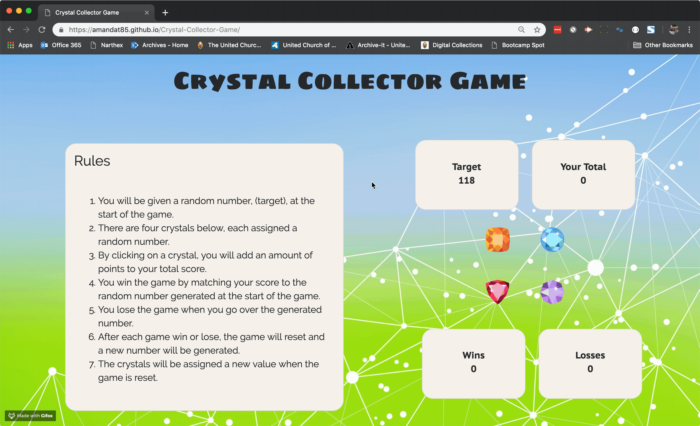

# Crystal Collector Game
The objective of this game is to get all the random values of the crystals that are clicked to equal the random generated target number.

## Site
https://amandatome.github.io/Crystal-Collector-Game/

## Assignment Details
[Homework Details](homework_instructions.md)

## Languages and Tools Used
* HTML 5
* CSS 3
* Bootstrap 4
* JavaScript
* jQuery
* Google Fonts

## Rules
* You will be given a random number, (target), at the start of the game.
* There are four crystals below, each assigned a random number.
* By clicking on a crystal, you will add an amount of points to your total score.
* You win the game by matching your score to the random number generated at the start of the game.
* You lose the game when you go over the generated number.
* After each game win or lose, the game will reset and a new number will be generated.
* The crystals will be assigned a new value when the game is reset.

## Animated Gif

